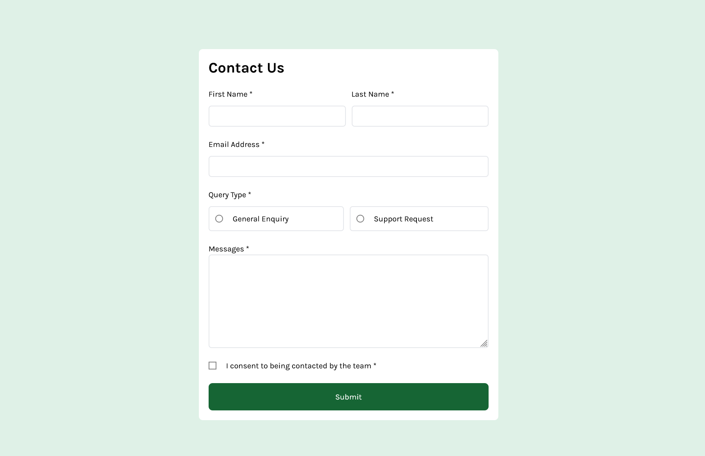
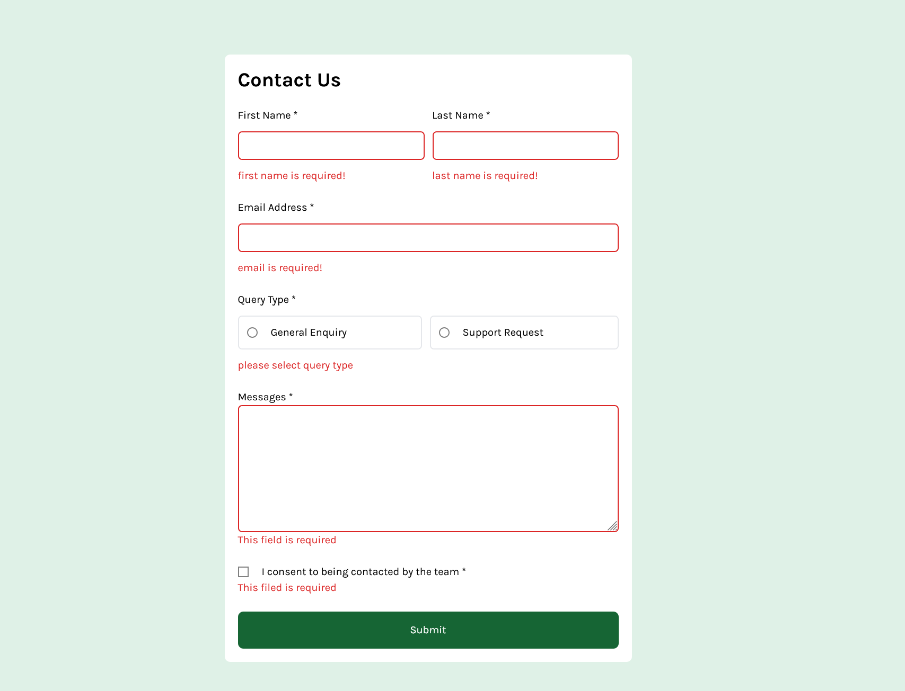
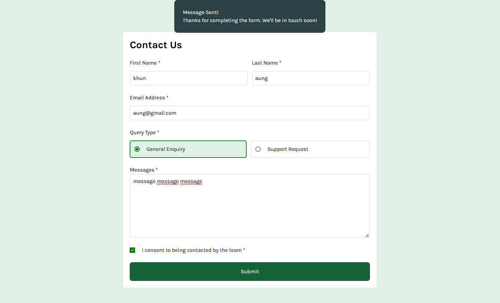
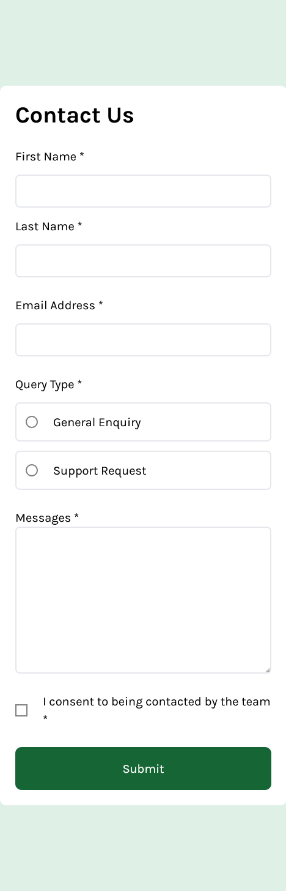
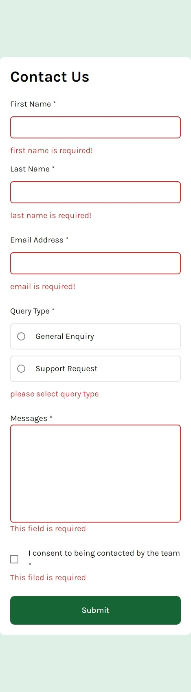
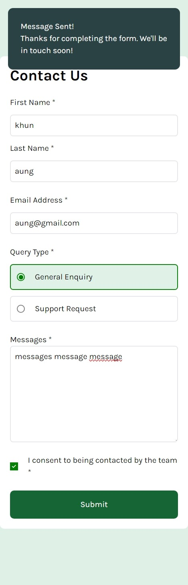

# Frontend Mentor - Contact form solution

This is a solution to the [Contact form challenge on Frontend Mentor](https://www.frontendmentor.io/challenges/contact-form--G-hYlqKJj). Frontend Mentor challenges help you improve your coding skills by building realistic projects. 

## Table of contents

- [Overview](#overview)
  - [The challenge](#the-challenge)
  - [Screenshot](#screenshot)
  - [Links](#links)
- [My process](#my-process)
  - [Built with](#built-with)
  - [What I learned](#what-i-learned)
  - [Continued development](#continued-development)
- [Author](#author)

**Note: Delete this note and update the table of contents based on what sections you keep.**

## Overview

### The challenge

Users should be able to:

- Complete the form and see a success toast message upon successful submission
- Receive form validation messages if:
  - A required field has been missed
  - The email address is not formatted correctly
- Complete the form only using their keyboard
- Have inputs, error messages, and the success message announced on their screen reader
- View the optimal layout for the interface depending on their device's screen size
- See hover and focus states for all interactive elements on the page

### Screenshot

### Links

- Solution URL: [GITHUB](https://github.com/Khunse/contactForm)
- Live Site URL: [Live site URL](https://khunse.github.io/contactForm/)

## My Process
### Built with

- HTML
- CSS custom properties
- Flexbox
- TailwindCSS
- Mobile-first workflow
- [React](https://reactjs.org/) - JS library

### What I learned

- Learned how to build website with mobile-first approach
- Learned to build responsive website
- Learned React

### Continued development

- want to improve my react project folder structure
- write clean code
- want to improve my website's responsiveness more smoothly

## Author

- Frontend Mentor - [@Khunse](https://www.frontendmentor.io/profile/Khunse)

